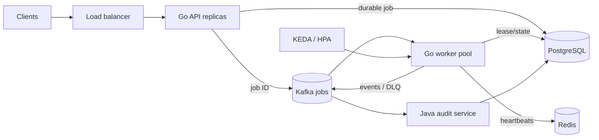

# CloudScale

CloudScale is a production-oriented distributed job execution platform. A Go API accepts authenticated, idempotent submissions; Kafka distributes work; horizontally scaled Go workers execute jobs under renewable PostgreSQL leases; Redis tracks worker liveness; and a Java service writes an independent audit trail.



## Distributed-systems behavior

- **Idempotency:** `(tenant_id, Idempotency-Key)` is unique. Client retries resolve to the existing durable job.
- **At-least-once delivery:** Kafka offsets are committed after terminal state or retry publication. PostgreSQL state guards duplicate execution.
- **Leases and heartbeats:** workers claim queued work with an owner and expiry, renew every 10 seconds, and stop updating when ownership is lost.
- **Failure recovery:** a sweeper requeues jobs whose worker lease expired. Retries use bounded attempts and incremental backoff.
- **Dead letters:** malformed messages and exhausted jobs enter `jobs.dlq`; the Java audit consumer preserves them for investigation.
- **Ordering and scale:** messages are keyed by job ID. Kafka partitions bound worker concurrency; Kubernetes HPA is provided and KEDA is recommended for consumer-lag scaling.
- **Tenant isolation:** signed JWTs supply tenant identity, and every read is scoped to that tenant.

## Run locally

```bash
cp .env.example .env
docker compose up --build
```

Issue a JWT containing a `tenant` claim using the configured HS256 secret, then submit:

```bash
curl -X POST http://localhost:8080/v1/jobs \
  -H "Authorization: Bearer $TOKEN" \
  -H "Idempotency-Key: report-2026-09-23" \
  -H "Content-Type: application/json" \
  -d '{"type":"sleep","payload":{"duration":"5s"},"max_attempts":4}'
```

Read status with `GET /v1/jobs/{id}` and the same bearer token. Built-in handlers are deliberately safe examples: `sleep` has a two-minute ceiling, while `checksum` echoes a bounded payload. Real handlers should run in isolated pods with per-job CPU, memory, network, and time limits.

## Components

| Component | Responsibility |
|---|---|
| `cmd/api` | JWT authentication, idempotent submission, status API |
| `cmd/worker` | Kafka consumption, leasing, heartbeats, execution, retry, DLQ |
| `audit-service` | Java/Spring Kafka consumer and append-only audit storage |
| PostgreSQL | Source of truth for jobs, leases, results, and audit events |
| Redis | Ephemeral worker presence and coordination data |
| Kafka | Work distribution, retry delivery, events, and dead letters |

## Production notes

The example demonstrates the mechanics rather than arbitrary-code execution. Before running untrusted jobs, add pod or Firecracker isolation, workload identity, egress policy, encrypted artifacts, quotas, cancellation fencing, and output-size limits. Replace the development JWT secret with OIDC/JWKS validation and apply row-level security. Use an outbox or Kafka transactions to close the database-write/message-publish gap. See [architecture](docs/architecture.md), [operations](docs/operations.md), and [threat model](docs/security.md).

## Repository layout

```text
cmd/api/            Go control-plane API
cmd/worker/         Go execution worker and lease recovery
internal/           Configuration, contracts, PostgreSQL store
audit-service/      Java 21/Spring audit microservice
infra/k8s/          Kubernetes deployments, PDB, HPA
infra/terraform/    AWS SQS, DLQ, S3, and observability baseline
```

MIT licensed.

